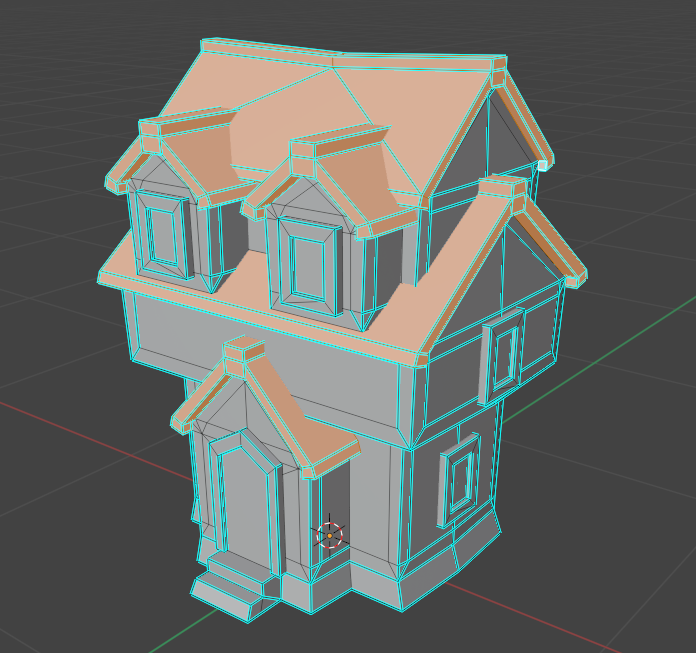
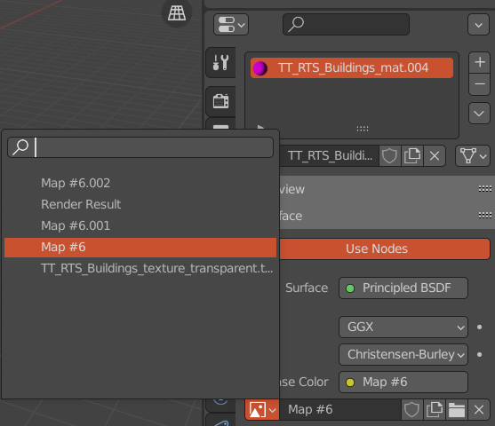

# Contents

0. Intro
1. Blender to adjust the 3D models
2. GIMP to create a "thumbnail" in the building menu
3. Notes on Code

# 0 - Intro

The purpose of this document is to give guidance through the steps that are 
necessary to add a 3D building model to the game. This will be done by example.

Currently (WS 2021/2022) the project has access to two sets of assets, which are 
both located under the *Assets* directory:
- *PolygonMini_Fantasy*
- *ToonyTinyPeople*

The process down below is mostly the same for both sets of assets.
We need to make some adjustments to the meshes so that we can apply team colors
at runtime.

Side note: apparently the first group have created their assets on their own, 
so don't be surprised if you can't find some of the existing models in the above
directories.

Finally, I'd like to mention that I'm not an artist. If you are one feel free to 
improve on this document! If you're a noob like myself I hope that this will be
of use to you.

Note: The name of the prefab/model/texture that is used below ("Guild...") was changed to
"Guild House..." afterwards to better differentiate between the building and the concept.

# 1 - Blender Stuff

Version: 2.93.5

If you've never used Blender it may be useful to watch some introductory 
tutorials on the Internet, especially regarding navigation :-). You won't need to 
know much though. The following should suffice (MMB := middle mouse button):
- Press MMB to "orbit"
- Press (Shift + MMB) to "pan"
- Scroll to "zoom in and out"
- Tab to "toggle between object and edit mode"

I am going to add 
*Assets/PolygonMini_Fantasy/Models/SM_Bld_Knights_House_03.fbx* 
to the game, which will serve as the level 3 version of the guild building. 
As you can see, it consists of only one mesh. I'm going to extract the roof parts
so that they can be colored with the tribe color:  
(You should just follow along with whatever building you want. It's up to you
 to decide which parts of the building should be extracted.)

Let's start:

1. Open Blender, select all objects (Cube, Camera, Light), and remove them from 
   the scene via the *Del* key or *right click -> Delete*.
2. Go to *File -> Import -> FBX (.fbx)* and select your model.
3. Once imported, press *Tab* to enter Edit Mode and turn on face selection.
   Press somewhere (left click) to undo the current selections.  
   
4. We're going to select all faces for the team color. Use (*Shift + left click*) 
   when selecting the faces (make sure to select tiny ones as well!). Use 
   *MMB*, (*Shift + MMB*), and *scroll* for navigation. This process can be a 
   bit cumbersome and it's easy to miss a face or two. My final result looks 
   like this:  
   
5. Once you're finished with the selection, press *P*, then choose *Selection* 
   from the menu. This will separate the selected nodes from the mesh. Now press 
   *Tab* to exit Edit Mode, select one of the meshes, and use the move tool to 
   move it as a quick test to see if everything worked. Undo the 
   move step afterwards.  
   
6. Now we're going to edit the materials. This step is not strictly necessary
   as we can set them later in Unity. For the models in *ToonyTinyPeople* we
   could do it all in Blender, however, because they come shipped with their 
   textures.
   In the top right corner, open the nodes and click on the red ball to open
   the materials section of your extracted mesh:  
     
   Now we're going to create a new material, copy & paste the old material into
   it to preserve some of its properties, and set the new material's base color
   to all white:  
     
   If the model is from *PolygonMini_Fantasy*, you don't have to do anything
   for the other material. I'm simply going to rename mine to "GuildMat".
   If the model is from *ToonyTinyPeople*, you could change the texture under
   *Base Color* (in this case *TT_RTS_Buildings_texture...*):  
   
7. Optional: rename the nodes  
   
8. Save your final result (*.blend*) and export it as *.fbx*
   (*File -> Export -> FBX (.fbx)*)
9. Import your *.fbx* file into Unity: *Assets/Models/Buildings*
   (e.g. via drag and drop). Rename it if necessary.
10. If you don't see any textures on your imported model, select it, and
    press *Materials* in the *Inspector*. The *TeamColor* material can be 
    found in *Assets/Materials/Structures/Buildings*. The material for 
    *PolygonMini_Fantasy* models seems to be *PolygonMinis_Fantasy_01.mat*.
    The material for *ToonyTinyPeople* seems to be *TT_RTS_Buildings.mat*,
    though you probably won't need this step for their (*ToonyTinyPeople*) 
    models:  
    
11. Let's make this a prefab. Create an empty GameObject in the scene
    (don't forget to reset the transform!) and 
    drag your model into it to make it a child thereof. Create a sibling for 
    the model and name it "Player Positions". Add four children to the latter,
    name them "P1" to "P4". Finally, add *BuildingAnimator.cs* as a component
    to the root GameObject, set its Size parameter to 4 and drag the
    appropriate objects into it. 
    Then you can drag this into an appropriate directory
    under *Assets/Prefabs/Structures/Buildings* and delete it from the scene:  
    
12. Open your new prefab so you see it in the scene view. Adjust the positions
    for "P1" to "P4" (this is where the players will stand).
    Also: deactivate these four! If "PN" is active that means someone is standing
    at that position. If all are active there won't be any spot left for the 
    player to stand.  
    
13. Let's quickly test our work. Open *Scenes/SampleScene* and select
    the *PrefabManager* in the *Hierarchy*. Choose one of the buildings and 
    replace it with your new prefab. I'm replacing the Library:  
    
14. Now go back to *Scenes/PersistentScene* and start the game. If I now
    try to build a Library I should see my new Guild building instead:  
    
15. This needs some rotation + scale. For *PolygonMini_Fantasy* models,
    a scale factor of around 7 seems to be fine. *ToonyTinyPeople* models don't
    need as much scaling (1.x), if any at all.  
    So rotating by 180 on y-axis and scaling by 7 (perhaps 6 would also do it)
    on all sides I get this:  
    
16. Don't forget to apply the changes to your prefab. You may have to adjust the
    "PN" positions as well.
17. Now go back to *Scenes/SampleScene* and undo your changes in
    *PrefabManager* (see step 13). Done!

# 2 - GIMP Stuff

Version: 2.10.22

Next we're going to create an image of our building that is to be shown in the
building menu:  

So we'll need a screenshot of our building and place it on that green hexagon.

Here is the latter:  

1. Open GIMP and drag & drop this image into it. Press *Layer -> New Layer*
   (*Ctrl + Shift * N*), name the layer "Building" (size should be 1000x1000) 
   and press OK:  
   
2. Back to Unity: open your building prefab, maximize the *Scene* view, toggle
   off the grid and make a screenshot (zoom in/out to get a proper size).
   Then paste it into GIMP:  
   
3. Right click on the *Floating Selection* (right side in Layers section)
   and select *Anchor Layer*:  
   
4. Select the *Fuzzy Select Tool* (shortcut: press *U*), click on the background
   and then press the *Del* key. The result should look like this:
   (if the background blends in with the object it may help to adjust the 
    threshold option of the *Fuzzy Select Tool*)  
   
5. Press *Select -> None* (*Shift + Ctrl + A*) to undo the selection. Adjust
   the position of the building with the *Move Tool* (press *M*). Save the file
   and press *File -> Export As -> .png*
6. Import the *.png* into Unity by putting it into *Assets/Textures/Buildings*
   (rename it if necessary):  
   
7. With the texture selected, go to the *Inspector* and set the texture type
   to *Sprite (2D and UI)*. Click *Apply*.
8. To test it, open *SampleScene* and select *Network UI -> UIManager* from
   the *Hierarchy*. Select one of the buildings from the *Inspector* and replace
   it with your new texture. I'm replacing the Library image:  
   
9. Back to *PersistentScene* and start the game. I should now see my Guild
   building's image in the building menu instead of the Library's image:  
   
10. Back to *SampleScene* and undo the changes from step 8. Done!

You may have noticed that the image looks rather flat, especially in comparison
to the other ones. Unfortunately I don't know how the first group created those
images, so I just took the image for the *Road* building, removed the Road from
it and put a bit of a gradient on the green ground. The rest is as described
above.

# 3 - Code Stuff

I'm not going to go through the whole process here as there are plenty of examples
for you to look at. Also, the process may vary depending on what kind of building
you want.

Just for a quick orientation, you'll **probably** have to look at *MyBuilding.cs*, 
*Packet.cs* and *Tribe.cs* on both server and client side. Additionally on client
side: *UIManager.cs* and *PrefabManager.cs* (don't forget their corresponding 
game objects in the Unity editor under *SampleScene*).