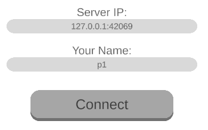

# Contents

1. Connecting over local network
2. Connecting with mobile data

# 1 - Local Connection

Take the following steps to connect to the server over your local network:

1. Start the server.
   - To do this, you will have to build the `GameServer.sln` and run the resulting
     `GameServer.exe` in the `bin` directory. Or you can just directly build and run
     the `GameServer.sln` with your IDE.
   - If you forget to do this, you will get stuck in the loading screen:  
     
2. Start the client, i.e. the game (either in Unity or in your phone).
3. Find the IP address of your server. In windows you can do so by typing `ipconfig`
   into the command prompt. Assuming you do this using the same machine which
   hosts the server, the IP address can be found under `IPv4 Address`.
   - Alternatively, if you are running Unity on the same machine, you can also use 
     `127.0.0.1` as the address.
4. Currently, the port is set to `42069`.

# 2 - Mobile Connection

Take the following steps to connect to the server with mobile data:

1. Again, start the server and also start the game on your phone.
2. You will also have to activate port forwarding in your router's settings:
   - This may be router specific. I do so by typing the `Default Gateway` address
     (see `ipconfig`) into the browser. From there I can adjust the settings.
   - Again, currently the default port is `42069`, so activate port forwarding for 
     this port.
3. Now you will have to determine the global IP address of the machine that is 
   running the server. Ways to do so:
   - Type "What's my IP address" into Google.
   - Visit "wieistmeineip.de"
   - ...
4. Connect to the server using whatever IP address you have determined 
   together with the port.