# General Workflow for Client/Server Communication

In general, the following classes are involved:

- Shared:
  - Packet (define names for your client and server packets)

- Server:
  - Server (couple client packets with methods in ServerHandle)
  - ServerHandle (contains methods to deal with client requests)
  - ServerSend (contains methods that send data to the clients)
  
- Client:
  - Client (couple server packets with methods in ClientHandle)
  - ClientHandle (contains methods to deal with server data)
  - ClientSend (contains methods that send data to the server)

Also see this YouTube playlist of Tom Weiland: https://www.youtube.com/playlist?list=PLXkn83W0QkfnqsK8I0RAz5AbUxfg3bOQ5
(This was used by the first group as the basis of this project).

Most of the work is usually done in UIManager (often the starting point), ClientHandle, and ServerHandle.

# Example: Upgrading a Building

A rough overview of the process:

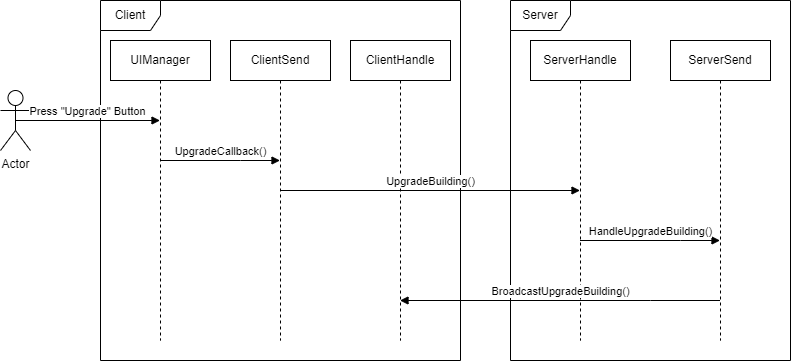

In the game, our starting point is the left panel. After pressing the upgrade button, it looks like in the right panel.

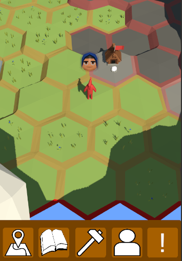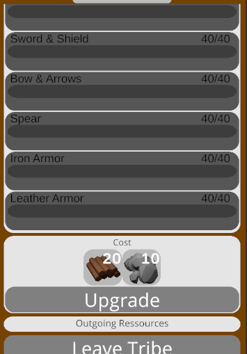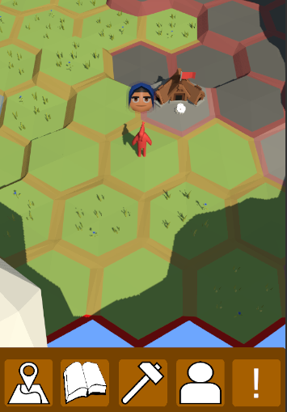

1. Packet names are defined in `Packet.cs` (in both, client and server):

    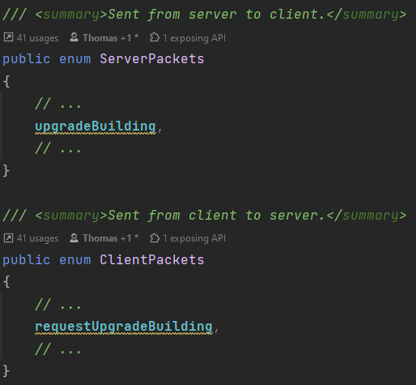

2. UI logic is handled in `UIManager.cs`. In this case, the button has a listener that simply passes the coordinates
   to `ClientSend::UpgradeBuilding()` and closes the panel afterwards:

    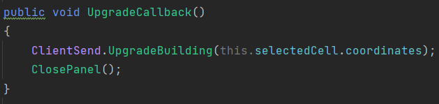

3. `ClientSend` constructs a packet for `ClientPackets.requestUpgradeBuilding` and writes all the necessary data to it 
    before sending it over the network:

    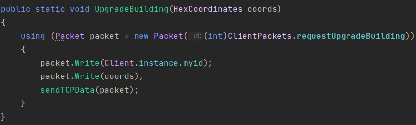

4. The server will receive this data. Usually you have one dedicated method in `ServerHandle` per client packet.
   The method will read the data out of the packet (order and types are important!), "do some game logic", and 
   then will probably send some data back to the client by using `ServerSend``:

    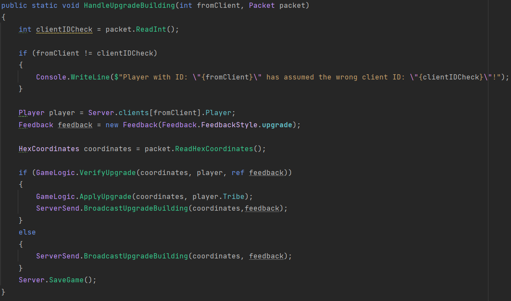

5. In order for this method to be called, you have to link it with the packet name in `Server::InitServerData()`:

    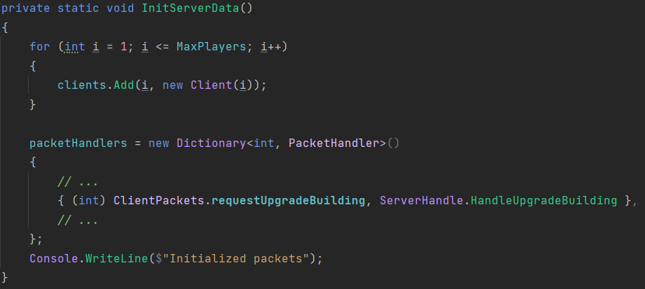

6. `ServerSend` constructs a packet for `ServerPackets.upgradeBuilding` and writes data into it before sending it:

    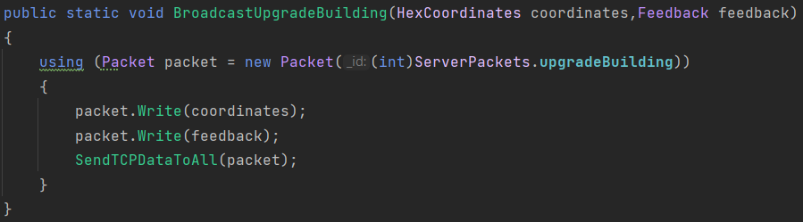

7. This packet will be handled on client-side by `ClientHandle`, which takes care of reading out the data in the packet,
   "doing some game logic" (e.g. increasing the building level) and updating the UI (e.g. show level 2 HQ model):

    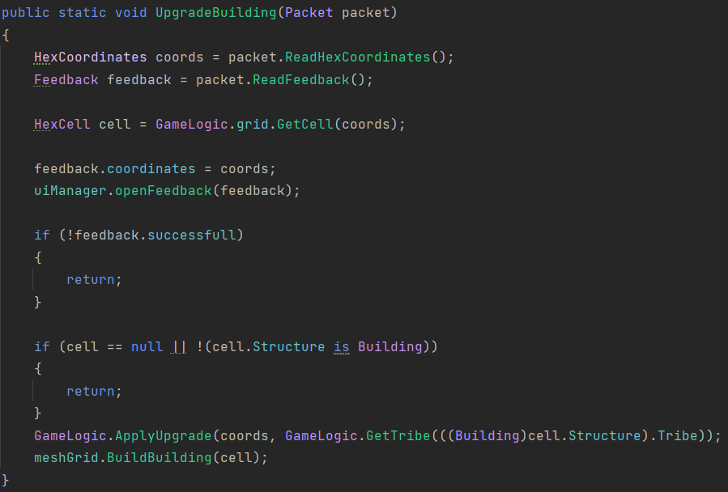

8. Analogous to step 4, the method has to be linked with the server packet in `Client::InitClientData()`:

    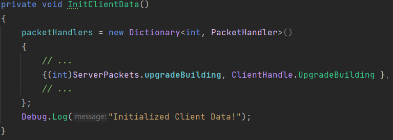

